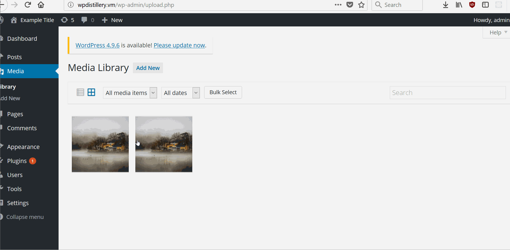
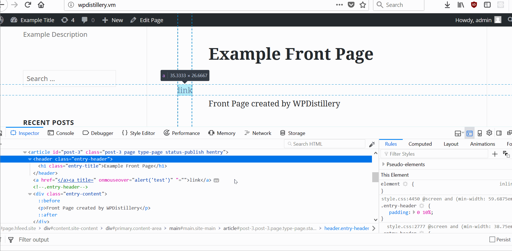

# Project 7 - WordPress Pentesting

Time spent: **6** hours spent in total

> Objective: Find, analyze, recreate, and document **five vulnerabilities** affecting an old version of WordPress

## Pentesting Report

1. Authenticated Stored Cross-Site Scripting via Image Filename
  - [ ] Summary:
    - Vulnerability types: Cross-Site Scripting
    - Tested in version: 4.2.0
    - Fixed in version: 4.2.1
  - [ ] GIF Walkthrough:
      
  - [ ] Steps to recreate:
       - Save image named xyz.jpg
       - log in to admin
       - upload image
       - open image location

  - [ ] Affected source code:
    - [Link 1](https://github.com/WordPress/WordPress/commit/c9e60dab176635d4bfaaf431c0ea891e4726d6e0)
2. Authenticated Stored Cross-Site Scripting (XSS)
  - [ ] Summary:
    - Vulnerability types: Cross Site Scripting
    - Tested in version: 4.2.0
    - Fixed in version: 4.2.3
  - [ ] GIF Walkthrough:
      
  - [ ] Steps to recreate:
        - inspect element
        - edit as html
        - paste code "<a href="</a><a title=" onmouseover=alert('test')  ">link</a>"
        - hover over link
  - [ ] Affected source code:
    - [Link 2](https://cve.mitre.org/cgi-bin/cvename.cgi?name=CVE-2015-5622)
3.  Comment Cross Site Scripting
  - [ ] Summary:
    - Vulnerability types: XSS
    - Tested in version: 4.2.0
    - Fixed in version: 4.5.2
  - [ ] GIF Walkthrough:
      
  - [ ] Steps to recreate:
        - post this comment "<a onmouseover="alert(unescape(/hello%20world/.source))">hello</a>"
        - hover over posted comment
  - [ ] Affected source code:
    - [Link 3](https://cve.mitre.org/cgi-bin/cvename.cgi?name=CVE-2018-5776)

## Resources

- [WordPress Source Browser](https://core.trac.wordpress.org/browser/)
- [WordPress Developer Reference](https://developer.wordpress.org/reference/)

GIFs created with [LiceCap](http://www.cockos.com/licecap/).

## Notes

The details for the blog which explained how to walkthrough the exploit did not work usually. I had to
modify the exploit to work which took some trial and error

## License

    Copyright [2019] [Ammar Karim]

    Licensed under the Apache License, Version 2.0 (the "License");
    you may not use this file except in compliance with the License.
    You may obtain a copy of the License at

        http://www.apache.org/licenses/LICENSE-2.0

    Unless required by applicable law or agreed to in writing, software
    distributed under the License is distributed on an "AS IS" BASIS,
    WITHOUT WARRANTIES OR CONDITIONS OF ANY KIND, either express or implied.
    See the License for the specific language governing permissions and
    limitations under the License.
